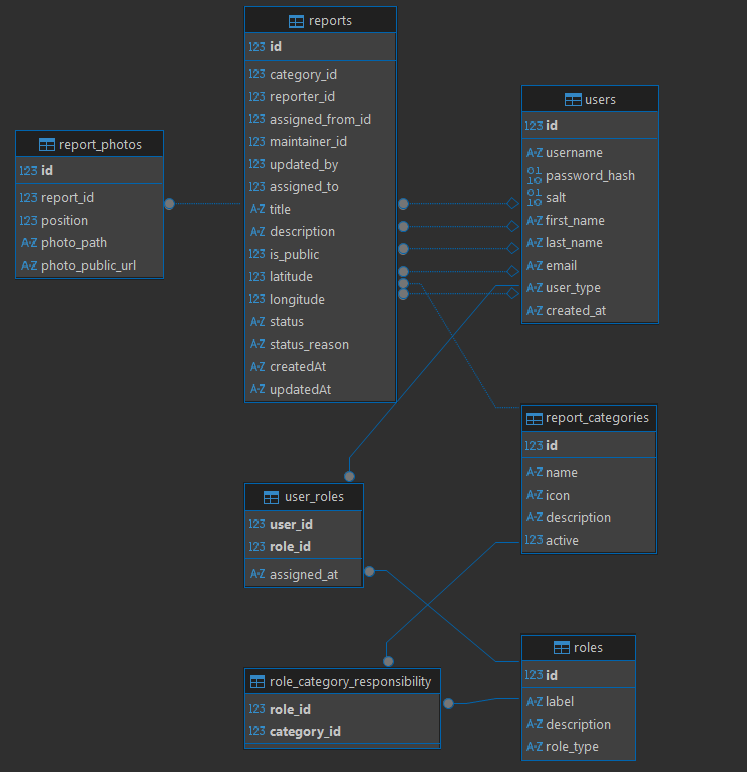

# Database structure overview

- Return to the [main README](../README.md).

## User & Role Management Database

---

### `users` Table

Stores information about all registered users, including citizens, municipality staff, and administrators.

| Column          | Type                                   | Description                                                                 |
| --------------- | -------------------------------------- | --------------------------------------------------------------------------- |
| `id`            | INTEGER PK AUTOINCREMENT               | Unique identifier for each user                                             |
| `username`      | TEXT UNIQUE NOT NULL                   | User’s login name                                                           |
| `password_hash` | TEXT NOT NULL                          | Hashed password of the user                                                 |
| `first_name`    | TEXT NOT NULL                          | User’s first name                                                           |
| `last_name`     | TEXT NOT NULL                          | User’s last name                                                            |
| `email`         | TEXT NOT NULL                          | User’s email address                                                        |
| `user_type`     | TEXT CHECK (`'citizen'`, `'municipality'`, `'admin'`) DEFAULT `'citizen'` | Defines the category of user (citizen, municipality, admin) |
| `created_at`    | DATETIME DEFAULT CURRENT_TIMESTAMP     | Timestamp indicating when the user was created                              |

---

### `roles` Table

Stores available roles that can be assigned to users to define their permissions or access level.

| Column         | Type                     | Description                                   |
| -------------- | ------------------------ | --------------------------------------------- |
| `id`           | INTEGER PK AUTOINCREMENT | Unique identifier for each role               |
| `label`        | TEXT UNIQUE NOT NULL     | Unique label or name of the role              |
| `description`  | TEXT                     | Optional description explaining the role’s use |

---

### `user_roles` Table

Represents the many-to-many relationship between users and roles. Each record assigns one role to one user.

| Column        | Type                                 | Description                                                      |
| ------------- | ------------------------------------ | ---------------------------------------------------------------- |
| `user_id`     | INTEGER FK → `users(id)`             | Identifier of the user being assigned a role                     |
| `role_id`     | INTEGER FK → `roles(id)`             | Identifier of the role assigned to the user                      |
| `assigned_at` | DATETIME DEFAULT CURRENT_TIMESTAMP   | Timestamp when the role was assigned                             |

**Primary Key:** (`user_id`, `role_id`)  
**Foreign Keys:**  
- `user_id` → `users(id)` ON DELETE CASCADE  
- `role_id` → `roles(id)` ON DELETE CASCADE  

---

## Ticket management

 - TODO in next sprint